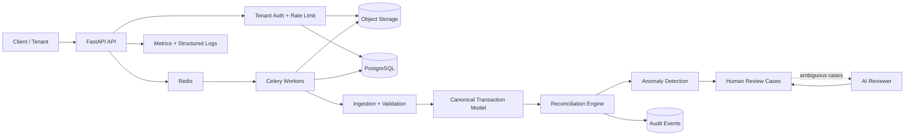
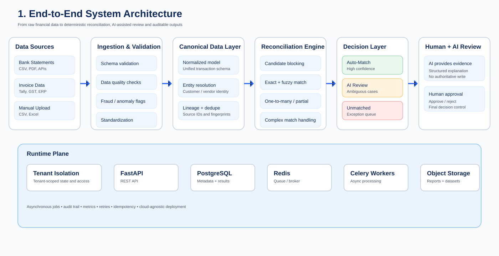
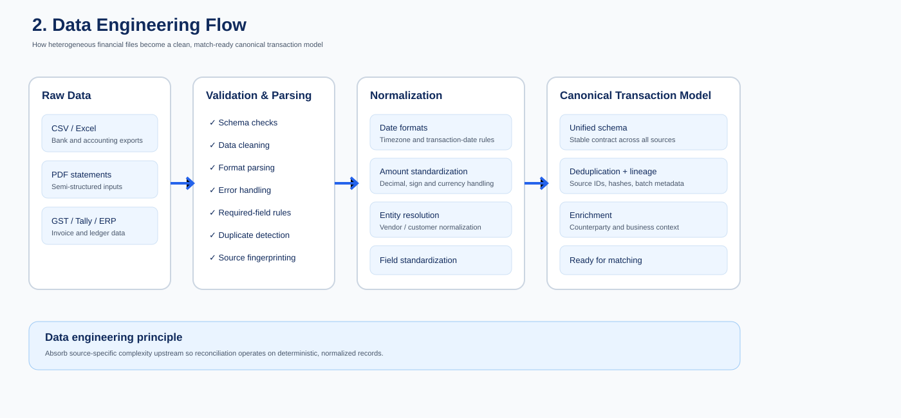
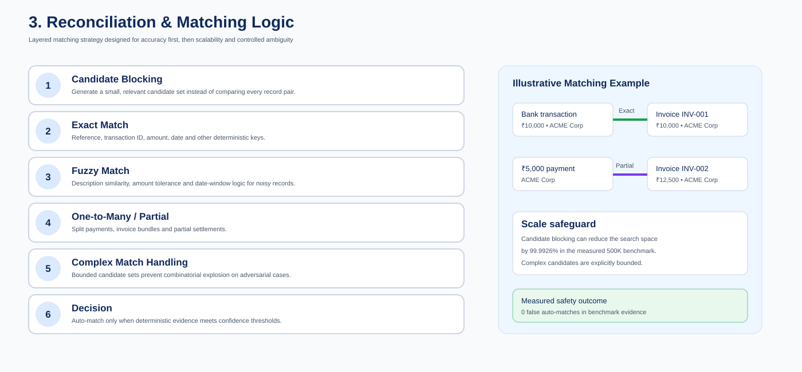
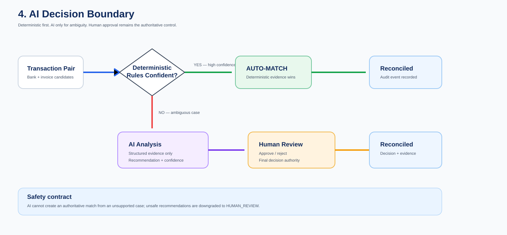

<div align="center">

# AI-Powered Financial Reconciliation Platform

### Production-Oriented Data Engineering + AI System

**Deterministic evidence decides. AI escalates ambiguity.**

[](https://github.com/abhi9265/ai-financial-reconciliation-platform/actions)
[](https://github.com/abhi9265/ai-financial-reconciliation-platform/actions)
[](https://www.python.org/)
[](https://fastapi.tiangolo.com/)
[](https://www.docker.com/)
[](https://www.postgresql.org/)
[](https://redis.io/)

**Financial Data → Canonical Model → Deterministic Reconciliation → Human / AI Review → Auditable Decision**

</div>

---

## What is this?

Financial reconciliation looks simple until the data is real.

Bank statements, invoices, Tally exports and accounting records rarely arrive with identical identifiers, naming, dates or payment structures. A production system therefore needs more than a fuzzy-match script: it needs **data contracts, lineage, idempotency, tenant isolation, asynchronous processing, explainable decisions, operational controls and measurable evidence**.

This project is built around that idea.

It is a **multi-tenant financial reconciliation platform** that:

- ingests heterogeneous financial records
- validates and normalizes them into a canonical transaction model
- performs exact, fuzzy, one-to-many and partial-payment reconciliation
- uses candidate blocking to control expensive matching work
- escalates ambiguous cases to human / AI-assisted review
- persists jobs, review cases and audit events
- supports asynchronous processing with Celery + Redis
- exposes operational health and metrics
- runs as a containerized production-style topology

> **Core design principle:** the LLM is an advisor, not the source of truth.

---

## Executive Engineering Scorecard

| Area | Evidence |
|---|---|
| **Reconciliation scale** | **500K synthetic cases** |
| **Candidate reduction** | **99.9926%** |
| **Full-match recall** | **100%** on generated ground truth |
| **Auto-match precision** | **100%** on generated ground truth |
| **Partial-payment accuracy** | **100%** |
| **False auto-matches** | **0** in benchmark |
| **API load smoke** | **1,199 req/s** |
| **API test volume** | **1,000 requests / 25 concurrency** |
| **AI safety evaluation** | **400 adversarial cases** |
| **AI safety result** | Unsafe recommendation downgraded to human review |
| **Deployment** | Docker + Compose + AWS staging IaC + CI validation |
| **Security** | Dependency, container, auth, isolation and DAST checks |
| **Architecture** | Multi-tenant, async, auditable, cloud-agnostic |

> **Evidence note:** these are controlled engineering measurements from CI/test environments, not production SLAs or claims of customer-scale capacity.

---

## Architecture & Engineering Map

The diagram below is the **primary visual architecture map** for the project. It is intentionally dense: instead of three small, generic diagrams, it shows the system as an interview-ready engineering story — architecture, data flow, matching logic, AI governance, deployment, measured performance, repository structure and technology choices.


### 1. End-to-End Architecture — how financial data becomes an auditable decision

The first section explains the complete production path:

**Data Sources → Ingestion & Validation → Canonical Data Layer → Reconciliation Engine → Decision Layer → Human + AI Review → Outputs & Storage**

The important architectural choice is the separation between **data engineering** and **decisioning**.

- **Data Sources** absorb real-world heterogeneity: bank statements, invoices, Tally/GST/accounting exports and manual uploads.
- **Ingestion & Validation** performs schema validation, data-quality checks, anomaly/fraud flags, standardization and idempotent processing.
- **Canonical Data Layer** converts source-specific formats into a stable transaction contract with normalized dates, amounts, entities, currency handling, lineage and duplicate detection.
- **Reconciliation Engine** works only on the canonical model, which keeps matching logic independent of individual source formats.
- **Decision Layer** separates high-confidence auto-matches, ambiguous review cases and unmatched exceptions.
- **Human + AI Review** is deliberately downstream of deterministic evidence. AI assists with ambiguity; humans retain the final approval boundary.
- **Outputs & Storage** preserve reconciled results, audit trails, exception reports and datasets for downstream use.

This is the architecture boundary I would emphasize in a Data Engineer interview: **messy source systems are normalized once; downstream business logic operates on a controlled data contract.**

### 2. Data Engineering + Reconciliation — where the scalability and accuracy come from

The second and third sections show the core data-engineering pipeline and the layered matching strategy.

**Raw data → Validation & Parsing → Normalization → Canonical Model → Candidate Blocking → Exact/Fuzzy Matching → One-to-Many / Partial → Complex Match → Decision**

The system does not compare every transaction against every other transaction. Candidate blocking dramatically reduces the search space before expensive matching begins.

The matching layers then progress from cheaper and more deterministic logic to more complex cases:

1. **Blocking** narrows candidate sets.
2. **Exact matching** handles strong identifiers and exact financial attributes.
3. **Fuzzy matching** handles controlled variation in descriptions, dates and amounts.
4. **One-to-many / partial matching** handles split payments and bundled invoices.
5. **Complex matching** handles adversarial and ambiguous patterns while bounding combinatorial work.
6. **Decisioning** converts the evidence into MATCHED, REVIEW or UNMATCHED outcomes.

The benchmark evidence shown in the diagram is important because it connects architecture to measurable engineering results: **99.9926% candidate reduction, 100% full-match recall, 100% auto-match precision and 100% partial-payment accuracy on the selected synthetic benchmark.**

### 3. AI Decision Boundary + Deployment — AI is constrained, not trusted blindly

The fourth and fifth sections explain the production philosophy.

The decision boundary is intentionally asymmetric:

**Deterministic evidence → high-confidence auto-match**

while:

**Ambiguous evidence → AI-assisted analysis → human approval**

That means the AI layer is an **advisory component**, not the authoritative reconciliation engine.

For an ambiguous case, the AI reviewer can return structured evidence such as a recommendation, confidence and rationale. The platform still records the decision and preserves an audit trail. The safety harness also tests that an unsafe AI recommendation is downgraded to human review instead of becoming an automatic financial match.

The deployment side mirrors this separation:

- **FastAPI** handles the synchronous API boundary.
- **PostgreSQL** stores durable metadata, jobs, reconciliation state and audit information.
- **Redis** provides queue/broker infrastructure.
- **Celery workers** execute asynchronous reconciliation workloads.
- **Object storage** is the intended home for raw files, datasets and reports.
- **Observability and security controls** sit around the runtime rather than being treated as afterthoughts.

The result is a cloud-agnostic production topology that can map to AWS, Azure or another managed environment without changing the core reconciliation contract.

### 4. Performance + Production Evidence — architecture backed by measurements

The sixth section is the evidence layer: the project is not presented only through architecture diagrams or code.

The selected 500K benchmark measured:

- **500,000 bank rows**
- **559,887 invoice rows**
- **629 seconds runtime**
- **794 bank rows/sec**
- **2.81 GB peak Python memory**
- **99.9926% candidate reduction**
- **100% full-match recall**
- **100% auto-match precision**
- **100% partial-payment accuracy**
- **0 false auto-matches**

The production-readiness evidence also includes:

- **1,000 API requests at 25-concurrency**
- **1,199 req/s in the in-process load smoke test**
- **400 adversarial AI safety cases**
- explicit downgrade of an unsafe AI recommendation to human review
- Docker/Compose validation
- dependency, container, authentication, tenant-isolation and DAST checks
- CI-enforced regression and benchmark gates

> These are controlled test-environment measurements, not production SLA guarantees. The purpose is to demonstrate that the engineering claims are measurable and reproducible.

## Architecture at a glance

~~~text
                         ┌──────────────────────┐
                         │   Tenant / Client    │
                         └──────────┬───────────┘
                                    │ HTTPS
                                    ▼
                         ┌──────────────────────┐
                         │      FastAPI API     │
                         │ Auth • Rate Limit    │
                         └──────┬───────┬───────┘
                                │       │
                    raw files   │       │ jobs / audit
                                ▼       ▼
                         ┌──────────┐ ┌──────────┐
                         │  Object  │ │Postgres  │
                         │ Storage  │ │  State   │
                         └──────────┘ └────┬─────┘
                                           │
                         ┌─────────────────┘
                         │
                         ▼
                      ┌───────┐
                      │ Redis │
                      └───┬───┘
                          │
                          ▼
                   ┌────────────┐
                   │   Celery   │
                   │   Workers  │
                   └─────┬──────┘
                         │
                         ▼
              ┌───────────────────────┐
              │ Validation / Canonical│
              │ Data Engineering      │
              └───────────┬───────────┘
                          ▼
              ┌───────────────────────┐
              │ Reconciliation Engine │
              └───────────┬───────────┘
                          │
                    ┌─────┴─────┐
                    ▼           ▼
                 MATCHED      REVIEW
                                │
                                ▼
                           AI + Human
                                │
                                ▼
                             AUDIT
~~~

For the detailed production architecture, see **[docs/ARCHITECTURE.md](docs/ARCHITECTURE.md)**.

### Phase 2 — Deployable staging

The project now includes an AWS staging deployment package under **[infra/aws/staging](infra/aws/staging/)**:

- ECS Fargate API + Celery worker separation
- managed PostgreSQL and TLS-enabled Redis
- private data-tier subnets
- HTTPS Application Load Balancer
- encrypted/versioned S3 object storage
- Secrets Manager credentials
- immutable ECR images with scan-on-push
- CloudWatch logs
- Route 53 staging DNS
- Terraform validation in CI

The repository claims **deployable staging infrastructure**, not a live AWS URL. A real staging deployment requires an AWS account, ACM certificate, DNS zone and operator credentials.

### Phase 4 — Live AI evaluation

The repository now includes an opt-in live OpenAI evaluation harness for already-escalated REVIEW cases. It measures provider reliability and latency while preserving the deterministic engine as the authoritative financial decision layer. See **[docs/LIVE_AI_EVALUATION.md](docs/LIVE_AI_EVALUATION.md)**.

The live workflow is manually dispatched and requires an operator-provided `OPENAI_API_KEY` secret. Normal CI never calls an external model.

### Phase 3 — Production observability

The application now exposes Prometheus metrics, request-correlated structured logs, dependency-aware readiness checks, an optional local Prometheus/Grafana stack, and AWS CloudWatch reliability alarms. See **[docs/OBSERVABILITY.md](docs/OBSERVABILITY.md)**.


---

## Tech Stack

| Layer | Technology | Why |
|---|---|---|
| API | **FastAPI** | Typed, async-friendly service boundary |
| Data processing | **Python / Pandas / PyArrow** | Financial record transformation |
| Matching | **Deterministic + fuzzy algorithms** | Reproducible financial decisions |
| Durable state | **PostgreSQL** | Transactions, jobs, reviews, audit |
| Queue | **Redis + Celery** | Decouple API from long-running work |
| Object storage | **S3-compatible / local** | Raw-data durability and replay |
| AI | **Provider abstraction + OpenAI adapter** | Controlled advisory intelligence |
| Auth | **API keys + tenant binding** | Tenant-aware access control |
| Observability | **JSON logs + metrics + audit** | Operational traceability |
| Runtime | **Docker / Compose** | Reproducible deployment |
| CI/CD | **GitHub Actions** | Automated quality gates |

---

## Quick Start

### Local development

~~~bash
git clone https://github.com/abhi9265/ai-financial-reconciliation-platform.git
cd ai-financial-reconciliation-platform

python -m pip install -e ".[dev]"

# tests
python -m pytest -q

# lint
ruff check .

# deterministic demo
reconcile-demo --data-dir data/synthetic/seed
~~~

### Production-style local topology

~~~bash
cp .env.example .env
# Set secrets in .env
docker compose up --build
~~~

Then verify:

~~~bash
curl http://localhost:8000/health
curl http://localhost:8000/ready
curl http://localhost:8000/metrics
~~~

> For actual cloud deployment, follow **[docs/DEPLOYMENT.md](docs/DEPLOYMENT.md)**.

---

## Documentation

| Document | Purpose |
|---|---|
| [Production Architecture](docs/ARCHITECTURE.md) | System design, data flow, reliability and scaling |
| [Production Deployment](docs/DEPLOYMENT.md) | Local → staging → production deployment path |
| [Recruiter / Interview Demo](docs/RECRUITER_DEMO.md) | 60-second pitch, demo flow and interview questions |
| [System Architecture](architecture/architecture.md) | Existing architecture and contracts |
| [API Examples](docs/api-examples.md) | API usage examples |
| [Phase 1 Engineering Report](reports/phase1_mvp_report.md) | Earlier engineering milestone |
| [Environment Configuration](.env.example) | Configuration reference |
| [Source Contracts](data/contracts/source_contracts.json) | Data contract reference |

---

## Engineering Snapshot

| Capability | Implementation |
|---|---|
| API | FastAPI |
| Language | Python 3.11+ |
| Data processing | Pandas / PyArrow / deterministic matching |
| Persistence | PostgreSQL / SQLite fallback |
| Object storage | S3 / local object store |
| Async processing | Celery + Redis |
| AI | OpenAI Responses API behind provider abstraction |
| Authentication | API key + tenant binding |
| Isolation | Tenant-scoped storage, jobs, review cases and audit events |
| Observability | Structured JSON logs, request IDs, metrics, audit trail |
| Reliability | Idempotency, deterministic hashes, retries/redelivery configuration |
| Packaging | Docker |
| Local orchestration | Docker Compose |
| CI/CD | GitHub Actions |
| Security | Dependency audit, container build validation, security headers, Redis-backed rate limiting |
| Test coverage | Automated unit + integration suite |

---

## Architecture



### Processing contract

```text
Upload
  │
  ├── authenticate tenant
  ├── validate file type / size
  └── persist raw object
        │
        ▼
   Ingestion Boundary
        │
        ├── fingerprint
        ├── batch identity
        └── idempotency
        │
        ▼
   Validation + Normalization
        │
        ▼
   Canonical Transactions
        │
        ▼
   Reconciliation
        ├── Tier 1: deterministic evidence
        ├── Tier 2: conservative fuzzy evidence
        └── Tier 3: human / AI-assisted review
        │
        ▼
   Decision + Explanation
        │
        ├── matched
        ├── unmatched
        └── review
        │
        ▼
   Audit + Metrics + Report
```

---

## Why the Architecture Is Designed This Way

### 1. Deterministic core, AI at the boundary

Financial reconciliation is a high-consequence workflow. The system therefore does **not** allow an LLM to become the source of truth.

The decision hierarchy is:

1. Strong deterministic evidence
2. Conservative fuzzy evidence
3. Explicit exception
4. Optional AI review
5. Human approval

AI receives only already-validated ambiguous cases and returns structured review evidence. An AI recommendation does not silently become an automatic match.

### 2. Idempotency is a first-class concern

Repeated ingestion should not create duplicate business state.

The platform uses:

- SHA-256 file fingerprints
- deterministic ingestion batch IDs
- canonical record hashes
- persisted idempotency keys
- tenant-scoped job identifiers

This makes retries and replay behavior observable instead of relying on application luck.

### 3. Canonical data model

Source-specific schemas are normalized into a canonical transaction contract.

The model preserves:

- transaction semantics
- debit/credit direction
- transaction and invoice dates independently
- counterparty information
- tax components
- source system
- source record ID
- source file and row lineage
- schema version
- deterministic record identity

This prevents source-specific fields from leaking into the reconciliation engine.

---

## Matching Engine

The reconciliation engine uses an ordered evidence strategy.

### Tier 1 — deterministic

Signals include:

- exact reference/invoice identifier
- exact amount
- date tolerance
- compatible counterparty
- transaction-type compatibility

A reference match with a material amount mismatch is **not silently accepted**. It becomes an exception.

### Tier 2 — fuzzy

Ambiguous candidates can be evaluated using multiple signals:

- counterparty similarity
- amount difference
- date difference
- reference similarity
- transaction compatibility

The implementation deliberately uses conservative thresholds rather than maximizing match volume.

### Tier 3 — AI-assisted review

The AI adapter is provider-neutral and requests a structured response containing:

- recommendation
- confidence
- rationale
- model metadata

The deterministic engine remains authoritative.

---

## Engineering Readiness

A compact view of what the repository can demonstrate today — without turning the README into a wall of bold text.

### Evidence

```
  500K        99.9926%       100%        100%         0
  cases       candidate      recall      precision    false
              reduction                               auto-matches

  1,199       1,000 / 25     400         0
  req/s       requests /     AI cases    unsafe
              concurrency                auto-match escapes

  ─────────────────────────────────────────────────────────────
  These are controlled CI/test measurements, not production SLAs.
```

| Area | Current evidence |
|---|---|
| Reconciliation | 500K synthetic cases; full-match recall 100% |
| Decision quality | Auto-match precision 100%; partial-payment accuracy 100% |
| Candidate blocking | 99.9926% candidate-pair reduction |
| Safety boundary | Zero false auto-matches in the benchmark |
| API load | 1,000 requests at 25-way concurrency; 1,199 req/s |
| AI review | 400-case offline safety evaluation |
| Runtime | Docker + Compose with API, worker, PostgreSQL and Redis |
| Security | Automated dependency, container, auth, isolation and DAST checks |

### Deployment boundary

```
  BUILT + VERIFIED                  STILL REQUIRES REAL INFRASTRUCTURE

  ┌───────────────┐                 ┌──────────────────────────┐
  │ Data pipeline │                 │ Managed cloud resources  │
  │ Matching core │                 │ Production secrets / TLS │
  │ API + workers │ ──────────────▶ │ Monitoring + alerting    │
  │ Audit + auth  │                 │ Backup / recovery        │
  │ CI safeguards │                 │ Customer data validation │
  └───────────────┘                 └──────────────────────────┘
```

The repository is deployment-ready at the application level, but no live cloud environment, customer workload, production SLA/RPO/RTO, third-party penetration test, or live AI provider evaluation is represented as completed.

### AI boundary

```
  deterministic evidence
           │
           ▼
      reconciliation
           │
      ┌────┴────┐
      │         │
    MATCH     REVIEW
                │
                ▼
           AI advisory
                │
                ▼
          human decision
```

The AI layer is intentionally advisory. Ambiguous financial decisions remain reviewable and auditable rather than being silently promoted to automatic matches.

## Benchmarking & Complex Reconciliation

The repository keeps the original 100-row seed benchmark as a fast regression test and adds an adversarial benchmark for harder reconciliation behavior.

The adversarial generator covers:

- vendor-name variants and noisy references
- amount/date mismatches
- one-to-many payments
- partial payments without prematurely consuming invoices
- explicit REVIEW cases
- deterministic ground-truth labels

The complex matcher uses candidate blocking before expensive scoring. Blocking combines date windows, amount buckets, normalized counterparty names, and shared name tokens. The benchmark reports measured correctness and runtime rather than storing target numbers.

Run:

~~~bash
python scripts/run_adversarial_benchmark.py --cases 250 --seed 42
~~~

For scale experiments, increase `--cases` and record the observed runtime, rows/second, candidate-pair count, and failure modes in `reports/adversarial-benchmark.md`. The current measured 10K/100K evidence was produced by GitHub Actions with seed 42; larger gates are kept as explicit evidence runs rather than assumptions.

### Original synthetic regression benchmark

- **100** bank transactions
- **95** purchase invoices
- **90** deterministic matches
- **5** amount-mismatch review cases
- **5** unmatched transactions

Current evaluation remains a deliberately simple regression fixture. Its perfect result is not presented as evidence of production accuracy.

The harder adversarial benchmark is the primary engineering evaluation for complex matching behavior.

---

## Multi-Tenant Design

Tenant boundaries are enforced across the application rather than being a UI convention.

### Tenant-aware resources

- uploaded objects
- reconciliation jobs
- review cases
- audit events
- API credentials
- rate-limit keys

Example object namespace:

```text
tenants/{tenant_id}/raw/{source_system}/{file}
```

A tenant API key is cryptographically compared and bound to its authorized tenant. A valid credential for tenant A cannot be used to access tenant B.

---

## Distributed Processing

For production-style workloads:

```text
FastAPI
   │
   ▼
PostgreSQL ── job state
   │
   └── Redis ── Celery broker
                    │
                    ▼
              Worker pool
                    │
                    ▼
             Reconciliation
```

Celery is configured with:

- JSON task serialization
- late acknowledgements
- prefetch multiplier = 1
- task-start tracking
- bounded hard/soft execution time
- broker connection retry on startup

This separates request handling from reconciliation execution and provides a path to horizontal worker scaling.

---

## Reliability & Observability

Every request receives an `X-Request-ID`.

The platform records:

- request route
- HTTP status
- request latency
- reconciliation outcomes
- job lifecycle events
- AI review metadata
- tenant-scoped audit events

Operational endpoints include:

- `GET /health`
- `GET /ready`
- `GET /metrics`
- `GET /v1/audit`

The audit layer is append-oriented and tenant scoped.

---

## Security Model

The repository includes several defense layers:

- tenant-bound API authentication
- constant-time API-key comparison
- tenant authorization
- file type validation
- 10 MiB upload limits
- safe tenant identifiers
- object-key path traversal protection
- repository data-path validation
- security response headers
- tenant-scoped rate limiting
- dependency vulnerability auditing
- container build validation
- secrets excluded from source control

Production secrets are expected to come from the deployment platform's secret-management mechanism.

---

## Production Runtime

Docker Compose provides the complete local production topology:

```text
┌──────────────┐
│    FastAPI   │
└──────┬───────┘
       │
 ┌─────┴─────────────┐
 │                   │
 ▼                   ▼
PostgreSQL         Redis
                       │
                       ▼
                 Celery Worker
                       │
                       ▼
                 Object Storage
```

Run:

```bash
cp .env.example .env
# Configure secrets in .env
docker compose up --build
```

For cloud deployment, the same application is designed to use managed PostgreSQL, Redis, S3-compatible object storage, centralized observability, TLS termination, and platform-managed secrets.

---

## Repository Structure

```text
.
├── architecture/                 # system design and data contracts
├── data/
│   ├── schemas/                  # source/canonical schemas
│   └── synthetic/                # reproducible benchmark data
├── reports/                      # engineering reports and evaluation
├── src/reconciliation_platform/
│   ├── ai/                       # provider abstraction + OpenAI adapter
│   ├── anomaly/                  # anomaly detection
│   ├── api/                      # FastAPI boundary
│   ├── decisioning/              # review/decision contracts
│   ├── ingestion/                # ingestion + upload handling
│   ├── models/                   # canonical domain model
│   ├── normalization/            # source → canonical mapping
│   ├── reconciliation/           # matching engine
│   ├── storage/                  # SQLite/PostgreSQL/object storage
│   ├── validation/               # schema/business validation
│   ├── observability.py          # logs, metrics, audit
│   ├── rate_limit.py             # tenant throttling
│   └── worker.py                 # Celery entrypoint
├── tests/
│   ├── integration/
│   └── unit/
├── .github/workflows/
│   ├── ci.yml
│   └── security.yml
├── Dockerfile
├── docker-compose.yml
└── pyproject.toml
```

---

## Engineering Quality Gates

Every change is expected to pass:

```text
Lint
  ↓
Unit + Integration Tests
  ↓
Coverage Gate
  ↓
Dependency Security Audit
  ↓
Docker Production Build
  ↓
Docker Compose Validation
```

The repository's production-hardening work has been merged to `main`, including distributed workers, tenant rate limiting, auditability, observability, security checks, and container validation.

---

## API Surface

| Endpoint | Purpose |
|---|---|
| `GET /health` | Liveness |
| `GET /ready` | Dependency readiness |
| `POST /v1/reconcile` | Synchronous tenant-scoped reconciliation |
| `POST /v1/reconcile/async` | Queue reconciliation job |
| `GET /v1/reconcile/jobs/{job_id}` | Poll job status/result |
| `GET /v1/audit` | Tenant-scoped audit events |
| `GET /metrics` | Operational metrics |

---

## Local Development

```bash
python -m pip install -e ".[dev]"

# deterministic benchmark
reconcile-demo --data-dir data/synthetic/seed

# tests
python -m pytest -q

# lint
ruff check .

# production topology
docker compose up --build
```

---

## Engineering Decisions

| Decision | Rationale |
|---|---|
| Deterministic reconciliation before AI | Financial decisions need reproducible evidence |
| Canonical transaction model | Decouple source formats from business logic |
| Immutable/raw object boundary | Preserve replayability and lineage |
| PostgreSQL for durable state | Transactional job/review persistence |
| Redis + Celery | Decouple API latency from reconciliation workload |
| Tenant-scoped namespaces | Prevent cross-tenant data leakage |
| Structured audit events | Make decisions explainable and operationally traceable |
| Provider-neutral AI interface | Avoid coupling business logic to one model provider |
| Synthetic benchmark | Reproducible engineering validation without customer data |

---

## Engineering Documentation

- [System Architecture](architecture/architecture.md)
- [Production Architecture](docs/ARCHITECTURE.md)
- [Production Deployment Guide](docs/DEPLOYMENT.md)
- [Recruiter / Interview Demo](docs/RECRUITER_DEMO.md)
- [Architecture Diagrams](docs/architecture-diagrams.md)
- [API Examples](docs/api-examples.md)
- [Phase 1 Engineering Report](reports/phase1_mvp_report.md)
- [Phase 1 Customer-Shaped Validation Report](reports/customer-shaped-validation-report.md)
- [Environment Configuration](.env.example)
- [Source Contracts](data/contracts/source_contracts.json)

---

## Project Status

**Engineering status: production-oriented foundation complete; Phase 1 realistic customer-shaped data validation is now implemented and CI-gated.**

The repository has been hardened through automated testing, dependency security checks, container validation, tenant isolation, asynchronous processing, observability, and distributed-worker support. The current milestone extends the reconciliation engine with adversarial data generation, candidate blocking, one-to-many matching, partial-payment handling, and measured scalability benchmarking.

The repository now includes a production deployment blueprint, container/Compose deployment validation in CI, a recruiter-facing demo script and architecture documentation. Phase 1 now includes deterministic customer-shaped validation across bank/Tally/GST-style inputs, partial payments, one-to-many matching, date windows, incompatible financial noise, unmatched exceptions and canonical-contract validation. See [docs/CUSTOMER_DATA_VALIDATION.md](docs/CUSTOMER_DATA_VALIDATION.md). A live public deployment is intentionally a separate infrastructure step requiring external cloud credentials and managed services. This repository does not claim production customer usage or live financial accuracy.

---

## Architecture — Four Deep-Dive Views

### 1. End-to-End System Architecture

The complete runtime path from heterogeneous financial sources through validation, canonicalization, deterministic reconciliation, controlled AI review, human approval, and auditable outputs.



### 2. Data Engineering Flow

The data-engineering boundary is deliberately upstream of reconciliation: source-specific parsing, validation, normalization, deduplication, lineage, and enrichment produce a stable canonical transaction contract before matching begins.



### 3. Reconciliation & Matching Logic

Matching is layered from candidate blocking and deterministic exact matching through fuzzy matching, partial/one-to-many handling, and bounded complex matching. This keeps the search space controlled while preserving auditability.



### 4. AI Decision Boundary

AI is deliberately advisory rather than authoritative. Deterministic evidence can auto-match high-confidence cases; ambiguous cases receive structured AI analysis and then go through human approval. Unsafe AI recommendations are downgraded to human review.



## License

This project is an engineering portfolio implementation using synthetic financial data.