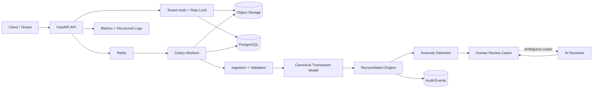

# AI-Powered Financial Reconciliation Platform

> **Production-oriented financial reconciliation platform with deterministic matching, measured scalability evidence, auditable data flows, and advisory AI review.**

A multi-tenant reconciliation platform designed around a simple engineering principle:

**deterministic evidence decides; AI escalates ambiguity.**

The system ingests heterogeneous financial records, validates and normalizes them into a canonical transaction model, reconciles records through ordered evidence tiers, persists auditable decisions, and exposes asynchronous processing for scale.

This repository is intentionally built as a **systems engineering portfolio project**, not a notebook or CRUD demo.

---

## Engineering Snapshot

| Capability | Implementation |
|---|---|
| API | FastAPI |
| Language | Python 3.11+ |
| Data processing | Pandas / PyArrow / deterministic matching |
| Persistence | PostgreSQL / SQLite fallback |
| Object storage | S3 / local object store |
| Async processing | Celery + Redis |
| AI | OpenAI Responses API behind provider abstraction |
| Authentication | API key + tenant binding |
| Isolation | Tenant-scoped storage, jobs, review cases and audit events |
| Observability | Structured JSON logs, request IDs, metrics, audit trail |
| Reliability | Idempotency, deterministic hashes, retries/redelivery configuration |
| Packaging | Docker |
| Local orchestration | Docker Compose |
| CI/CD | GitHub Actions |
| Security | Dependency audit, container build validation, security headers, Redis-backed rate limiting |
| Test coverage | Automated unit + integration suite |

---

## Architecture



### Processing contract

```text
Upload
  │
  ├── authenticate tenant
  ├── validate file type / size
  └── persist raw object
        │
        ▼
   Ingestion Boundary
        │
        ├── fingerprint
        ├── batch identity
        └── idempotency
        │
        ▼
   Validation + Normalization
        │
        ▼
   Canonical Transactions
        │
        ▼
   Reconciliation
        ├── Tier 1: deterministic evidence
        ├── Tier 2: conservative fuzzy evidence
        └── Tier 3: human / AI-assisted review
        │
        ▼
   Decision + Explanation
        │
        ├── matched
        ├── unmatched
        └── review
        │
        ▼
   Audit + Metrics + Report
```

---

## Why the Architecture Is Designed This Way

### 1. Deterministic core, AI at the boundary

Financial reconciliation is a high-consequence workflow. The system therefore does **not** allow an LLM to become the source of truth.

The decision hierarchy is:

1. Strong deterministic evidence
2. Conservative fuzzy evidence
3. Explicit exception
4. Optional AI review
5. Human approval

AI receives only already-validated ambiguous cases and returns structured review evidence. An AI recommendation does not silently become an automatic match.

### 2. Idempotency is a first-class concern

Repeated ingestion should not create duplicate business state.

The platform uses:

- SHA-256 file fingerprints
- deterministic ingestion batch IDs
- canonical record hashes
- persisted idempotency keys
- tenant-scoped job identifiers

This makes retries and replay behavior observable instead of relying on application luck.

### 3. Canonical data model

Source-specific schemas are normalized into a canonical transaction contract.

The model preserves:

- transaction semantics
- debit/credit direction
- transaction and invoice dates independently
- counterparty information
- tax components
- source system
- source record ID
- source file and row lineage
- schema version
- deterministic record identity

This prevents source-specific fields from leaking into the reconciliation engine.

---

## Matching Engine

The reconciliation engine uses an ordered evidence strategy.

### Tier 1 — deterministic

Signals include:

- exact reference/invoice identifier
- exact amount
- date tolerance
- compatible counterparty
- transaction-type compatibility

A reference match with a material amount mismatch is **not silently accepted**. It becomes an exception.

### Tier 2 — fuzzy

Ambiguous candidates can be evaluated using multiple signals:

- counterparty similarity
- amount difference
- date difference
- reference similarity
- transaction compatibility

The implementation deliberately uses conservative thresholds rather than maximizing match volume.

### Tier 3 — AI-assisted review

The AI adapter is provider-neutral and requests a structured response containing:

- recommendation
- confidence
- rationale
- model metadata

The deterministic engine remains authoritative.

---

## Engineering Status\n\n**Production-oriented foundation:** implemented and continuously verified by CI.\n\n**Measured scale evidence:** 10K and 100K cases have been executed successfully with deterministic seed 42. Larger gates (250K, 500K and 1M) are run separately and are not described as supported until their measured results are reviewed.\n\n**Measured AI evidence:** the repository contains a 400-case live evaluation harness, but no live accuracy/latency result is claimed without an actual provider credential and completed run.\n\n**Deployment status:** the repository is deployable with Docker/Compose, but no external production deployment or customer workload is claimed.\n\n## Known Limitations\n\n- Synthetic benchmarks are engineering evidence, not proof of production financial accuracy.\n- A real production deployment still requires managed infrastructure, secret management, TLS, centralized monitoring, backup retention and tested recovery procedures.\n- Production RPO/RTO values are deployment-specific and are intentionally not invented here.\n- A third-party penetration test/security assessment has not been represented as completed.\n- Real customer/accountant validation and production financial datasets have not been represented as completed.\n- AI recommendations remain advisory; human approval is required for ambiguous cases.\n\n## Benchmarking & Complex Reconciliation

The repository keeps the original 100-row seed benchmark as a fast regression test and adds an adversarial benchmark for harder reconciliation behavior.

The adversarial generator covers:

- vendor-name variants and noisy references
- amount/date mismatches
- one-to-many payments
- partial payments without prematurely consuming invoices
- explicit REVIEW cases
- deterministic ground-truth labels

The complex matcher uses candidate blocking before expensive scoring. Blocking combines date windows, amount buckets, normalized counterparty names, and shared name tokens. The benchmark reports measured correctness and runtime rather than storing target numbers.

Run:

~~~bash
python scripts/run_adversarial_benchmark.py --cases 250 --seed 42
~~~

For scale experiments, increase `--cases` and record the observed runtime, rows/second, candidate-pair count, and failure modes in `reports/adversarial-benchmark.md`. The current measured 10K/100K evidence was produced by GitHub Actions with seed 42; larger gates are kept as explicit evidence runs rather than assumptions.

### Original synthetic regression benchmark

- **100** bank transactions
- **95** purchase invoices
- **90** deterministic matches
- **5** amount-mismatch review cases
- **5** unmatched transactions

Current evaluation remains a deliberately simple regression fixture. Its perfect result is not presented as evidence of production accuracy.

The harder adversarial benchmark is the primary engineering evaluation for complex matching behavior.

---

## Multi-Tenant Design

Tenant boundaries are enforced across the application rather than being a UI convention.

### Tenant-aware resources

- uploaded objects
- reconciliation jobs
- review cases
- audit events
- API credentials
- rate-limit keys

Example object namespace:

```text
tenants/{tenant_id}/raw/{source_system}/{file}
```

A tenant API key is cryptographically compared and bound to its authorized tenant. A valid credential for tenant A cannot be used to access tenant B.

---

## Distributed Processing

For production-style workloads:

```text
FastAPI
   │
   ▼
PostgreSQL ── job state
   │
   └── Redis ── Celery broker
                    │
                    ▼
              Worker pool
                    │
                    ▼
             Reconciliation
```

Celery is configured with:

- JSON task serialization
- late acknowledgements
- prefetch multiplier = 1
- task-start tracking
- bounded hard/soft execution time
- broker connection retry on startup

This separates request handling from reconciliation execution and provides a path to horizontal worker scaling.

---

## Reliability & Observability

Every request receives an `X-Request-ID`.

The platform records:

- request route
- HTTP status
- request latency
- reconciliation outcomes
- job lifecycle events
- AI review metadata
- tenant-scoped audit events

Operational endpoints include:

- `GET /health`
- `GET /ready`
- `GET /metrics`
- `GET /v1/audit`

The audit layer is append-oriented and tenant scoped.

---

## Security Model

The repository includes several defense layers:

- tenant-bound API authentication
- constant-time API-key comparison
- tenant authorization
- file type validation
- 10 MiB upload limits
- safe tenant identifiers
- object-key path traversal protection
- repository data-path validation
- security response headers
- tenant-scoped rate limiting
- dependency vulnerability auditing
- container build validation
- secrets excluded from source control

Production secrets are expected to come from the deployment platform's secret-management mechanism.

---

## Production Runtime

Docker Compose provides the complete local production topology:

```text
┌──────────────┐
│    FastAPI   │
└──────┬───────┘
       │
 ┌─────┴─────────────┐
 │                   │
 ▼                   ▼
PostgreSQL         Redis
                       │
                       ▼
                 Celery Worker
                       │
                       ▼
                 Object Storage
```

Run:

```bash
cp .env.example .env
# Configure secrets in .env
docker compose up --build
```

For cloud deployment, the same application is designed to use managed PostgreSQL, Redis, S3-compatible object storage, centralized observability, TLS termination, and platform-managed secrets.

---

## Repository Structure

```text
.
├── architecture/                 # system design and data contracts
├── data/
│   ├── schemas/                  # source/canonical schemas
│   └── synthetic/                # reproducible benchmark data
├── reports/                      # engineering reports and evaluation
├── src/reconciliation_platform/
│   ├── ai/                       # provider abstraction + OpenAI adapter
│   ├── anomaly/                  # anomaly detection
│   ├── api/                      # FastAPI boundary
│   ├── decisioning/              # review/decision contracts
│   ├── ingestion/                # ingestion + upload handling
│   ├── models/                   # canonical domain model
│   ├── normalization/            # source → canonical mapping
│   ├── reconciliation/           # matching engine
│   ├── storage/                  # SQLite/PostgreSQL/object storage
│   ├── validation/               # schema/business validation
│   ├── observability.py          # logs, metrics, audit
│   ├── rate_limit.py             # tenant throttling
│   └── worker.py                 # Celery entrypoint
├── tests/
│   ├── integration/
│   └── unit/
├── .github/workflows/
│   ├── ci.yml
│   └── security.yml
├── Dockerfile
├── docker-compose.yml
└── pyproject.toml
```

---

## Engineering Quality Gates

Every change is expected to pass:

```text
Lint
  ↓
Unit + Integration Tests
  ↓
Coverage Gate
  ↓
Dependency Security Audit
  ↓
Docker Production Build
  ↓
Docker Compose Validation
```

The repository's production-hardening work has been merged to `main`, including distributed workers, tenant rate limiting, auditability, observability, security checks, and container validation.

---

## API Surface

| Endpoint | Purpose |
|---|---|
| `GET /health` | Liveness |
| `GET /ready` | Dependency readiness |
| `POST /v1/reconcile` | Synchronous tenant-scoped reconciliation |
| `POST /v1/reconcile/async` | Queue reconciliation job |
| `GET /v1/reconcile/jobs/{job_id}` | Poll job status/result |
| `GET /v1/audit` | Tenant-scoped audit events |
| `GET /metrics` | Operational metrics |

---

## Local Development

```bash
python -m pip install -e ".[dev]"

# deterministic benchmark
reconcile-demo --data-dir data/synthetic/seed

# tests
python -m pytest -q

# lint
ruff check .

# production topology
docker compose up --build
```

---

## Engineering Decisions

| Decision | Rationale |
|---|---|
| Deterministic reconciliation before AI | Financial decisions need reproducible evidence |
| Canonical transaction model | Decouple source formats from business logic |
| Immutable/raw object boundary | Preserve replayability and lineage |
| PostgreSQL for durable state | Transactional job/review persistence |
| Redis + Celery | Decouple API latency from reconciliation workload |
| Tenant-scoped namespaces | Prevent cross-tenant data leakage |
| Structured audit events | Make decisions explainable and operationally traceable |
| Provider-neutral AI interface | Avoid coupling business logic to one model provider |
| Synthetic benchmark | Reproducible engineering validation without customer data |

---

## Engineering Documentation

- [System Architecture](architecture/architecture.md)
- [Architecture Diagrams](docs/architecture-diagrams.md)
- [API Examples](docs/api-examples.md)
- [Phase 1 Engineering Report](reports/phase1_mvp_report.md)
- [Environment Configuration](.env.example)
- [Source Contracts](data/contracts/source_contracts.json)

---

## Project Status

**Engineering status: production-oriented foundation complete; active scalability and data-engineering benchmark development.**

The repository has been hardened through automated testing, dependency security checks, container validation, tenant isolation, asynchronous processing, observability, and distributed-worker support. The current milestone extends the reconciliation engine with adversarial data generation, candidate blocking, one-to-many matching, partial-payment handling, and measured scalability benchmarking.

A live public deployment is intentionally a separate infrastructure step. This repository does not claim production customer usage or live financial accuracy.

---

## License

This project is an engineering portfolio implementation using synthetic financial data.
