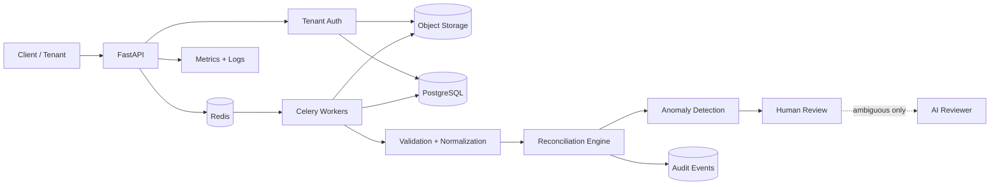
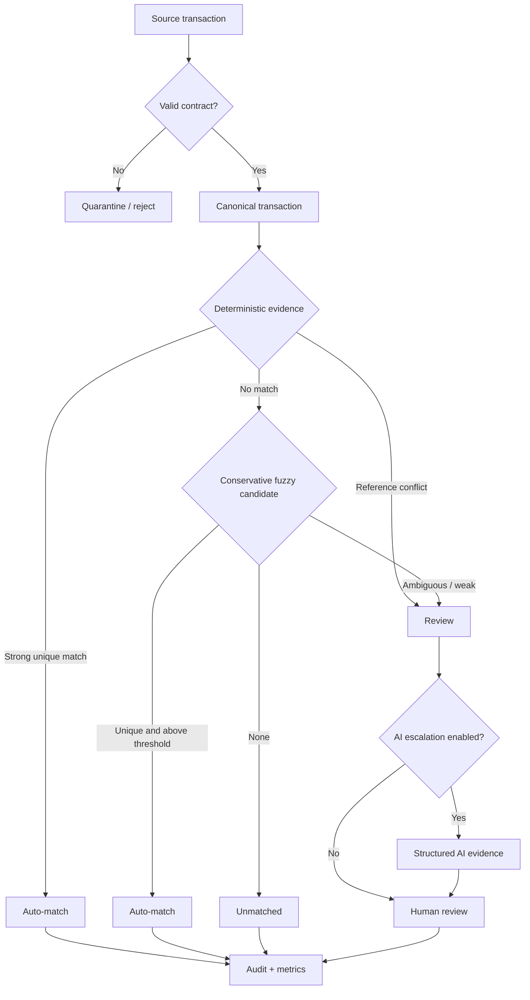
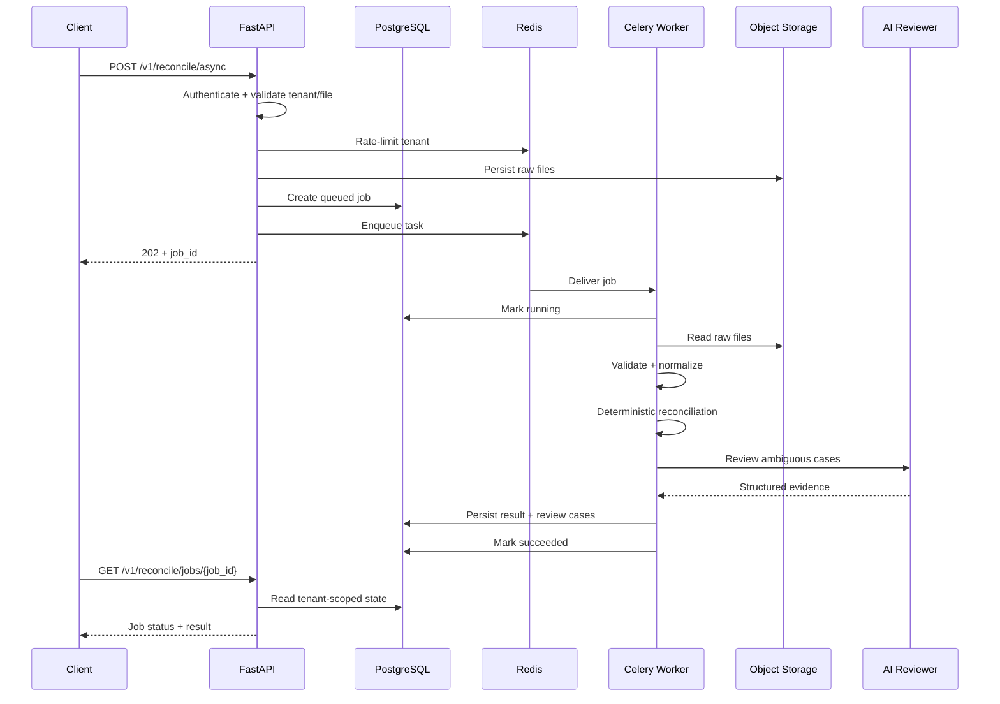
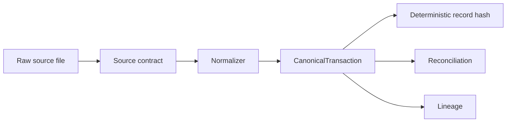

# Architecture Diagrams

## Runtime topology

## Reconciliation decision flow

## Async execution sequence

## Data contract boundary

These diagrams are aligned with the executable implementation in the source tree.
